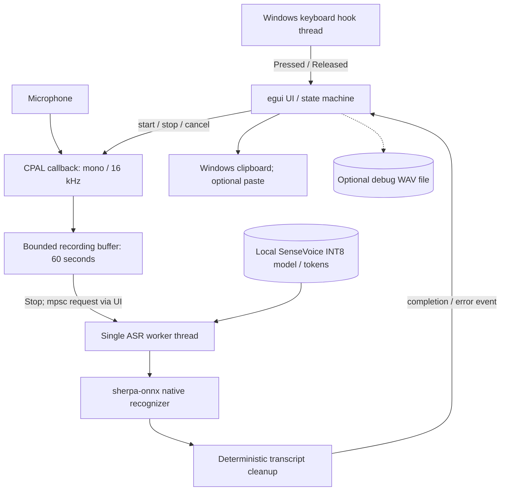

# TinySTT

Offline push-to-talk speech recognition for Windows.

**Status:** 🟡 Early preview

[Download](https://github.com/styayur/TinySTT/releases/latest) · [Documentation](docs/architecture.md) · [Releases](https://github.com/styayur/TinySTT/releases) · [Issues](https://github.com/styayur/TinySTT/issues)

[](https://github.com/styayur/TinySTT/actions/workflows/ci.yml)
[](LICENSE)


What is TinySTT?
----------------

TinySTT is a minimal, fully offline push-to-talk speech-to-text utility for
Windows. It runs on your machine with
[Rust](https://www.rust-lang.org/), [CPAL](https://github.com/RustAudio/cpal),
[sherpa-onnx](https://github.com/k2-fsa/sherpa-onnx), and the
[SenseVoice](https://github.com/QwenAudio/SenseVoice) INT8 model.

There is no cloud API, account, browser, Python, Node.js, Electron, Tauri,
Docker, FFmpeg, HTTP server, WebSocket, database, or telemetry.

**Hold `Ctrl+Alt+D` → Speak → Release → Text.**

TinySTT does not send your audio or transcript to any server.

### Actual WAV recognition

After downloading the documented SenseVoice model and extracting the portable release:

```powershell
.\TinySTT.exe --file .\models\sensevoice\test_wavs\en.wav --model-dir .\models\sensevoice --language en
```

Actual stdout from the local v0.1.0 portable executable on 2026-10-09:

```text
The tribal chieftain called for the boy and presented him with 50 pieces of code.
```

This is an unedited recognition result from the model's bundled sample, not an accuracy benchmark; the final word is retained exactly as recognized. It demonstrates file inference, not microphone capture or a GUI screenshot. [Run provenance and capture limitation](docs/architecture/DEMONSTRATION.md).

Features
--------

- Fully local CPU inference with SenseVoice INT8
- Hold-to-talk global shortcut with true key-up detection
- Chinese, English, Cantonese, Japanese, and Korean
- Model loaded once and reused by a single ASR worker
- Bounded 60-second recording buffer
- English/Chinese transcript copied to the Windows clipboard automatically
- Optional auto-paste, disabled by default
- Manual Record / Stop / Cancel controls
- Tray menu for Open, Enable/Disable Hotkey, and Exit
- Portable configuration beside the executable
- Optional debug WAV export
- CLI WAV recognition for testing without a microphone

Requirements
------------

To build from source on Windows you need:

1. **Rust stable with the MSVC target**. Install with
   [rustup](https://rustup.rs) and select
   `x86_64-pc-windows-msvc`.
2. **Visual Studio Build Tools** with the
   **Desktop development with C++** workload.
3. A microphone visible to Windows.

The Rust `sherpa-onnx` build script downloads a matching prebuilt native
library during the first build. TinySTT itself performs no network requests at
runtime.

Download TinySTT
----------------

Download the latest Windows portable ZIP from
[GitHub Releases](https://github.com/styayur/TinySTT/releases/latest).

The release archive contains the executable, configuration example, license,
third-party notices, and an empty model directory. The model is intentionally
separate because it is about 156 MiB and has its own license.

Download the model
------------------

TinySTT uses:

**`sherpa-onnx-sense-voice-zh-en-ja-ko-yue-int8-2024-07-17`**

Official source:

<https://github.com/k2-fsa/sherpa-onnx/releases/download/asr-models/sherpa-onnx-sense-voice-zh-en-ja-ko-yue-int8-2024-07-17.tar.bz2>

PowerShell example:

```powershell
Set-Location path\to\TinySTT

New-Item -ItemType Directory -Force models | Out-Null
curl.exe -L -o sensevoice.tar.bz2 `
  https://github.com/k2-fsa/sherpa-onnx/releases/download/asr-models/sherpa-onnx-sense-voice-zh-en-ja-ko-yue-int8-2024-07-17.tar.bz2

Get-FileHash .\sensevoice.tar.bz2 -Algorithm SHA256
# Expected: 7D1EFA2138A65B0B488DF37F8B89E3D91A60676E416F515B952358D83DFD347E

tar -xf .\sensevoice.tar.bz2 -C .\models
Move-Item `
  .\models\sherpa-onnx-sense-voice-zh-en-ja-ko-yue-int8-2024-07-17 `
  .\models\sensevoice
Remove-Item .\sensevoice.tar.bz2
```

Expected layout:

```text
TinySTT/
├─ TinySTT.exe
└─ models/
   └─ sensevoice/
      ├─ model.int8.onnx
      └─ tokens.txt
```

Only `model.int8.onnx` and `tokens.txt` are required by the application. The
archive also contains samples and documentation that may be useful for
verification. See [docs/model-provenance.md](docs/model-provenance.md) for the
exact source, size, and SHA-256.

If the files are missing, TinySTT displays
`SenseVoice model files were not found.` and lists every path it searched. It
never downloads a model automatically.

Build
-----

```powershell
git clone https://github.com/styayur/TinySTT
Set-Location TinySTT
cargo build --release
```

The binary is `target\release\TinySTT.exe`.

Run
---

Place `models\sensevoice` beside the executable, then launch:

```powershell
.\target\release\TinySTT.exe
```

On startup the model is loaded once in a background ASR worker. Hold
`Ctrl+Alt+D`, speak, and release. The result appears in the window and is
copied to the clipboard.

Core commands
-------------

- **Record** – start microphone capture without the global shortcut.
- **Stop** – stop capture and recognize the current recording.
- **Cancel** – discard the recording buffer without recognition.
- **Copy** – copy the displayed transcript again.
- **Save WAV** – export the last recording as 16 kHz mono PCM for debugging.
- **Ctrl+Alt+D** – push-to-talk while TinySTT is running, including when the
  window is not focused.

Recording is capped at 60 seconds. Recordings shorter than 250 ms are ignored.
If recognition is already running, the shortcut reports `Busy` and rejects the
new recording.

CLI WAV test
------------

The same executable provides a microphone-free test path:

```powershell
.\target\release\TinySTT.exe --file .\test.wav
```

Optional arguments:

```text
--model-dir <dir>       Model directory override
--num-threads 1|2|4     CPU inference threads
--language auto|zh|en|yue|ja|ko
```

The WAV is converted to 16 kHz mono in Rust. FFmpeg is not used. Text is written
to stdout so the command can be used in scripts.

Configuration
-------------

Copy `config.example.toml` to `config\config.toml` beside the executable. The
file is created automatically when settings are saved.

```toml
model_dir = ""
num_threads = 2
hotkey = "Ctrl+Alt+D"
auto_paste = false
microphone = ""
language = "auto"
```

- `model_dir` – optional model directory; relative paths are resolved from the
  executable directory.
- `num_threads` – CPU threads used by ONNX Runtime.
- `hotkey` – one non-modifier key plus modifiers, for example `Ctrl+Shift+D`.
- `auto_paste` – after successful recognition and clipboard copy, send
  `Ctrl+V`. This is **off by default** because it inserts text into the active
  application.
- `microphone` – exact device name; empty selects the Windows default.
- `language` – `auto`, `zh`, `en`, `yue`, `ja`, or `ko`.

Thread, language, and model-directory changes apply after restart. Microphone,
hotkey, and auto-paste settings are used on the next recording or immediately
after Save.

Privacy
-------

TinySTT is offline by design:

- No audio or transcript is uploaded.
- No account, telemetry, analytics, update check, or remote logging is used.
- Runtime logs contain timings, errors, and device names only. They never
  contain raw audio or the full recognized transcript.
- The model is downloaded by the user, not by TinySTT.
- Auto-paste is optional and disabled by default.

The only network activity belongs to the Rust build tooling when the
`sherpa-onnx` crate downloads its prebuilt native library. Building from source
is not required for users of the portable release.

Portable ZIP
------------

```powershell
.\scripts\package-portable.ps1 -Version 0.1.0
```

The result is:

```text
dist/TinySTT-windows-x64-v0.1.0.zip
dist/SHA256SUMS.txt
```

Model weights are intentionally not included.

## Architecture

<!-- architecture:overview:start -->

<!-- architecture:overview:end -->

TinySTT is a native desktop push-to-talk application with an additional WAV CLI, not a CLI-only SDK. Capture is controlled by key press/release or UI buttons. Preprocessing downmixes and resamples; there is no separate VAD module. The ASR worker owns one recognizer and processes requests serially. The UI rejects recording while busy and forwards model/recognition errors.

Recording cancellation discards buffered audio before inference; in-flight ASR cancellation is not implemented. Audio/transcripts remain local at runtime. Clipboard delivery crosses into the OS and optional auto-paste affects the focused application; debug WAV export is explicit. See the existing architecture document for buffer contention, state transitions and failure details.

[Source evidence and diagram verification](docs/architecture/README.md).

Project layout
--------------

```text
src/
├─ main.rs              GUI / CLI entry point
├─ lib.rs               library exports
├─ app.rs               egui UI and application state
├─ state.rs             explicit state machine
├─ pipeline.rs          recording pipeline wrapper
├─ audio/
│  ├─ capture.rs        CPAL capture callback
│  ├─ convert.rs        mono conversion + streaming resampler
│  ├─ buffer.rs         bounded recording buffer
│  └─ wav.rs            WAV read/write
├─ asr/
│  ├─ mod.rs            SpeechRecognizer trait
│  ├─ sensevoice.rs     sherpa-onnx SenseVoice implementation
│  └─ worker.rs         single long-lived ASR worker
├─ hotkey.rs            global key-down/key-up hook
├─ clipboard.rs         Windows clipboard writer
├─ paste.rs             optional Ctrl+V injection
├─ tray.rs              system tray menu
├─ settings.rs          TOML settings
├─ paths.rs             portable paths + model discovery
├─ error.rs             user-readable errors
└─ log.rs               privacy-safe file logger
```

Architecture and thread boundaries are documented in
[docs/architecture.md](docs/architecture.md).

Tests and CI
------------

```powershell
cargo fmt --all -- --check
cargo clippy --all-targets --all-features -- -D warnings
cargo test --all --all-features
cargo build --release
```

The unit tests never load the real model. They cover audio conversion, bounded
buffering, resampling length, WAV round-trip, settings, paths, state
transitions, and the ASR abstraction through a fake recognizer. See
[.github/workflows/ci.yml](.github/workflows/ci.yml).

Release policy
--------------

Releases use semantic versions and tags such as `v0.1.0`. The release workflow
builds on Windows, repeats checks, produces
`TinySTT-windows-x64-vX.Y.Z.zip`, and publishes `SHA256SUMS.txt`.

Troubleshooting
---------------

### “SenseVoice model files were not found.”

Check that `models\sensevoice\model.int8.onnx` and
`models\sensevoice\tokens.txt` exist beside `TinySTT.exe`, or set `model_dir`
in `config\config.toml`.

### Hotkey does not start recording

Another application may already own the combination. Change `hotkey` in
`config\config.toml`, save, and restart. TinySTT does not silently ignore a
registration failure; the UI shows the Windows error.

### No microphone

TinySTT lists the configured name in the error. Clear the `microphone` setting
to use the Windows default, or enter the exact device name shown in Windows
sound settings.

### SmartScreen warning

The first preview release is an unsigned portable executable. Verify the
SHA-256 published with the release before running it.

Roadmap
-------

### Current

- Push-to-talk, recording, offline SenseVoice recognition, clipboard, optional
  auto-paste, tray, settings, WAV export, CLI, CI, and portable packaging.

### Next

- Signed releases and automatic update metadata without runtime telemetry.
- Better microphone selection UI.
- Streaming partial text only if it preserves the simple local-first design.

### Not planned for v0.1

- VAD, streaming partial transcripts, diarization, speaker recognition, cloud
  ASR, Whisper, Qwen ASR, translation, LLM correction, meeting transcription,
  REST/WebSocket APIs, history databases, or plugin systems.

Security
--------

Please do not report exploitable issues in a public issue. Follow
[SECURITY.md](SECURITY.md) and use GitHub private vulnerability reporting.

Contributing
------------

Development setup, scope rules, and validation commands are in
[CONTRIBUTING.md](CONTRIBUTING.md).

Licenses
--------

TinySTT application source is licensed under **AGPL-3.0-only**, following the
Stya Yur Open Source Studio policy for complete applications.

The SenseVoice model, sherpa-onnx native library, ONNX Runtime, Rust crates,
GUI framework, resampler code, and Windows API bindings remain under their own
licenses. See [THIRD_PARTY_NOTICES.md](THIRD_PARTY_NOTICES.md) and
[docs/model-provenance.md](docs/model-provenance.md).
